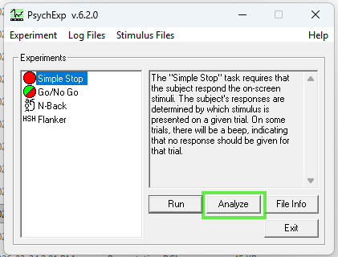
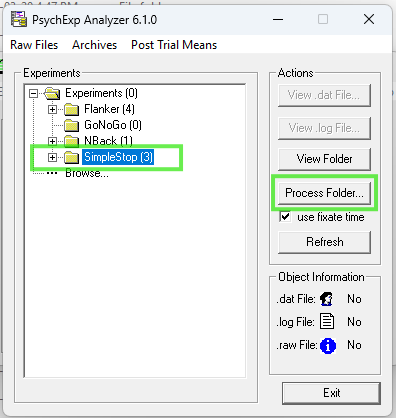
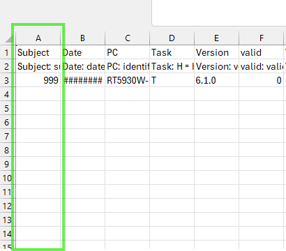
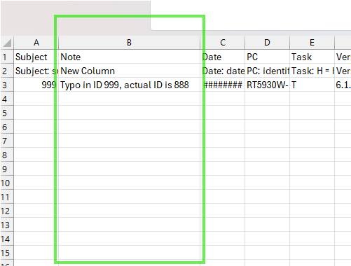
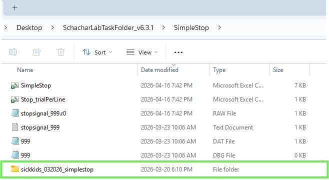
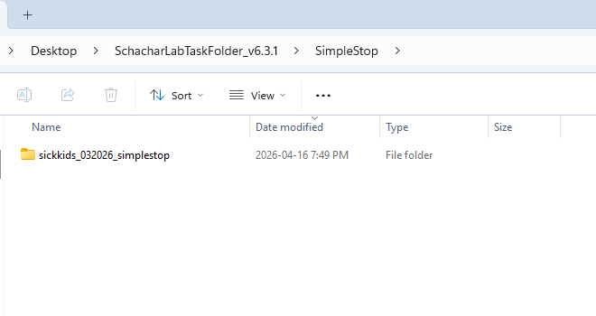
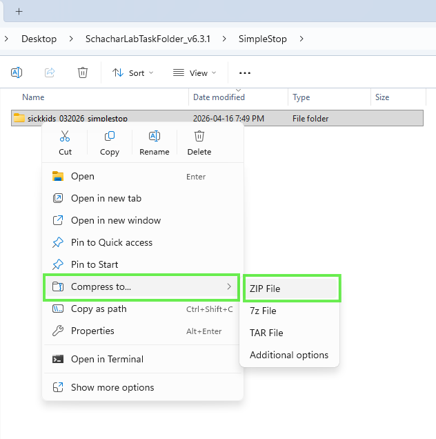
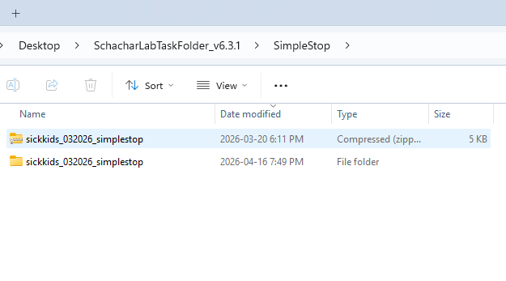

## Task Output Data Folders

When you run one of the tasks included in this task folder, it will save all task output data files in a sub-folder inside the **SchacharLabTaskFolder_v6.3.1 Folder**

-   SimpleStop

-   NBack

Ensure you are using unique subject numbers. There are five kinds of files in the data folders: .dat, .log, .dbg, .raw, and .csv

**.dat** contains parameters you set (i.e.: subject number, number of blocks and trials)

**.log** contains the timing output from Presentation

**.dbg** contains a debugging trail, used only to troubleshoot

**.raw** is a binary file created and used only by our scoring program

After you run the task, you will see the .dat, .log, .dbg but not the .raw, as that is created by the scoring program, PEAnalyze. Usually .raw files created with an older version of the scoring program will not be readable by newer versions. Instead, you reprocess the data in the newer scoring program and it overwrites the .raw file. The .raw file is expendable; you can always re-create it as long as you have the .dat and .log files.

When you process a data folder, it will also create two .csv files showing all the data in that folder in a single file that you can load into a spreadsheet. The first summary file will be named after the folder it is in, e.g.: for Simple Stop it will be **SimpleStop.csv** and the second named **Stop_trialPerLine.csv**. Each time the data is processed the two .csv files will be generated with the same name and overwrite the previous one with the same name. The column headings are somewhat cryptic (in order to save space in the spreadsheet headings), but if you compare it with a score sheet they are easy to map out.

We recommend backing up your data output files frequently to ensure no data is lost. To transfer data complete the following three stages: process data, clean data, and send

## Transfer Data

### Process

1.  Open **PsychExp** from the SchacharLabTaskFolder_v6.3.1 Folder or the shortcut from your Desktop.

<!-- -->

2.  Click on the task data you would like to access (SimpleStop or NBack), and then click **Analyze**.

{fig-align="center"}

3.  Highlight the folder (SimpleStop or NBack), and then select **Process Folder.** Once the folder is processed, click **OK**.

{fig-align="center"}

4.  To access the task output data files (the .dat, .raw, .dbg, and .log files), open the **SchacharLabTaskFolder_v6.3.1 Folder** and then open the task subfolder SimpleStop or NBack

### Clean

1.  Open the .csv that is named after the folder (e.g., SimpleStop.csv and NBack.csv). This file will list all the IDs that were processed. Check the IDs for **practice records, non-POND records, misnamed records, or repeated administration records**.

{fig-align="center"}

2.  If **practice** or **non-pond records** are identified in the .csv, find and remove all files related to these IDs (i.e. .dat, .raw, .dbg, and .log) from the SimpleStop or NBack folder
3.  Then reprocess the folder and check again to ensure only POND IDs appear in the .csv
4.  If **misnamed** or **repeated administration records** are identified add a column to the final .csv (SimpleStop.csv or NBack.csv) after the Subject column and enter the needed information to the row (e.g., Typo in ID actual ID is XXXXX, First administration ID:XXXXX crashed second administration ID:XXXXX should be used, etc) leave others blank

{fig-align="center"}

5.  If you have previously sent data ensure the current folder only contains NEW POND data and do not re-send previously sent data as it will cause files to duplicate

6.  Email [**crosbielab.admin\@sickkids.ca**](mailto:crosbielab.admin@sickkids.ca)if you would like to receive a list of previously sent POND IDs to confirm which files to exclude

### Send

1.  Create a New Folder named **yourpondsitename_MMYYYY_taskname** (e.g. sickkids_032026_simplestop) inside your task’s data folder (i.e., SimpleStop or NBack)

{fig-align="center"}

2.  Move all of the new .dat, .dbg, .log, .raw, and both .csv files for the new POND participants into the folder (do not copy the data as this will create duplicates in future transfers)

{fig-align="center"}

3.  Ensure your site retains a backup of this folder in accordance with your data storage practices 
4.  Left click the folder and select Compress To \> Zip File

{fig-align="center"}

5.  Send the zipped folder by email **Crosbie Lab (crosbielab.admin\@sickkids.ca)** using the subject line: yourpondsitename Stop & NBack POND Data quarter year (e.g., SickKids Stop & NBack POND Data Q1 2026) and include a note in the body of the email if there are notes in the task .csv file to resolve

{fig-align="center"}

Data from future task administrations will save in the general SimpleStop or NBack folder as usual and the new folders will not interfere with task administration. For future data transfers only send new task outputs.
