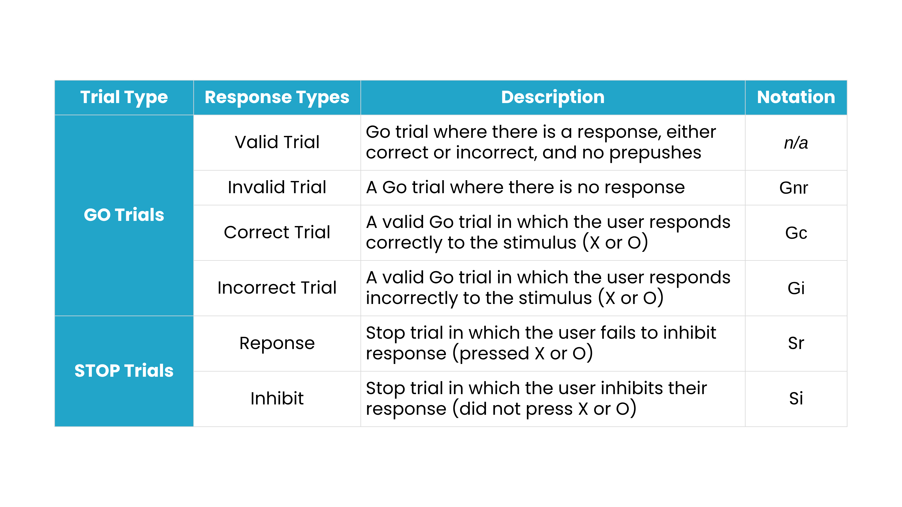
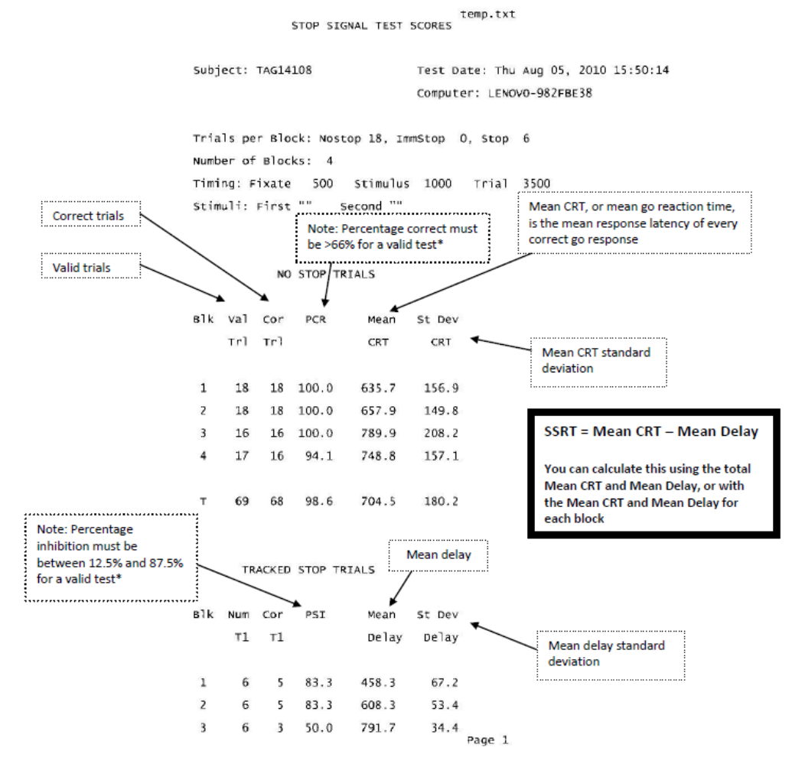
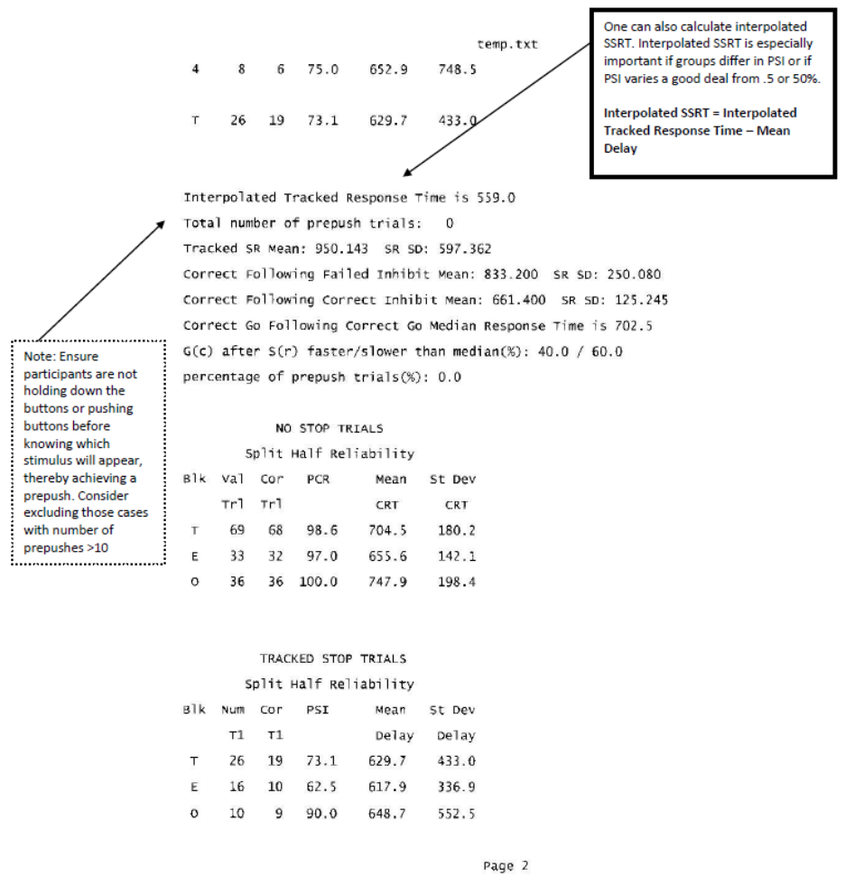
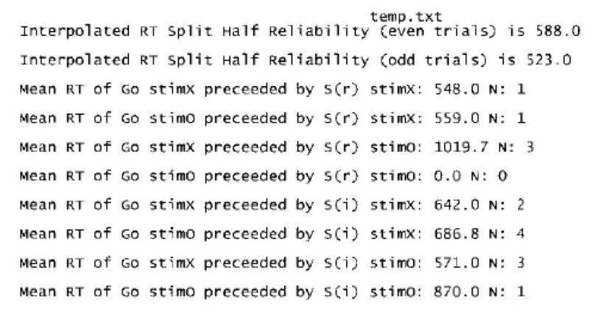
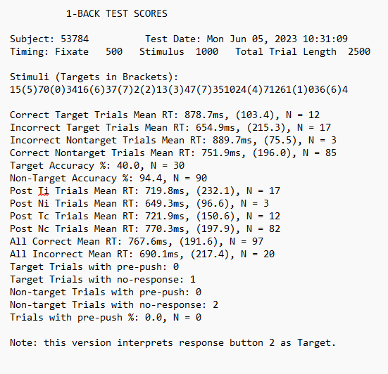

# Simple Stop & N-Back Task Interpretation Guide

## Task Output Data Folders

When you run one of the tasks included in this task folder, it will save all task output data files in a sub-folder inside the **SchacharLabTaskFolder_v6.3.1 Folder**

-   SimpleStop

-   NBack

Ensure you are using unique subject numbers. There are five kinds of files in the data folders: .dat, .log, .dbg, .raw, and .csv

**.dat** contains parameters you set (i.e.: subject number, number of blocks and trials)

**.log** contains the timing output from Presentation

**.dbg** contains a debugging trail, used only to troubleshoot

**.raw** is a binary file created and used only by our scoring program

After you run the task, you will see the .dat, .log, .dbg but not the .raw, as that is created by the scoring program, PEAnalyze. Usually .raw files created with an older version of the scoring program will not be readable by newer versions. Instead, you reprocess the data in the newer scoring program and it overwrites the .raw file. The .raw file is expendable; you can always re-create it as long as you have the .dat and .log files.

When you process a data folder, it will also create two .csv files showing all the data in that folder in a single file that you can load into a spreadsheet. The first summary file will be named after the folder it is in, e.g.: for Simple Stop it will be **SimpleStop.csv** and the second named **Stop_trialPerLine.csv**. Each time the data is processed the two .csv files will be generated with the same name and overwrite the previous one with the same name. The column headings are somewhat cryptic (in order to save space in the spreadsheet headings), but if you compare it with a score sheet they are easy to map out.

We recommend backing up your data output files frequently to ensure no data is lost. Read below to understand the contents of the task outputs for your own understanding or skip ahead to [Data Transfer](data-transfer.qmd) to learn how to send output for scoring.

## Understanding the Stop Task Output Files

The Stop Signal Task is a response inhibition task in which participants make a speeded response to a stimulus but must withhold their response when an infrequent stop signal is presented shortly after the go stimulus. The stop‑signal delay is dynamically adjusted using a tracking algorithm to target approximately 50% successful inhibition. Practice trials are not included in any calculations.

**Go trial:** A trial in which there is no signal to inhibit response (also called a no-stop trial).

**Stop trial:** A trial in which the user is prompted by a stop signal to inhibit their response after some experimentally controlled delay between the onset of the fixate and the latest time allowed for the placement of the stop signal. Notation Sr for the failure to inhibit response (also called a failed inhibit or signal-respond trial), and Si for inhibiting their response (also called a correct stop trial or signal-inhibit trial).

{fig-align="center"} **Interpolated Response Time:** Obtained as follows:

-   Gather a list of all the Gc trial response times

-   Sort the list in ascending order

-   Multiply the probability of inhibition by the number of Gc RTs to yield an integer we’ll call “spot”

-   The probability of inhibition is: the number of inhibitions/number of stop signals

-   Pick the nth RT from the sorted list, where n=the total number in the list-spot

**Prepushes:** While a single trial may have multiple prepushes, this report shows you how many trials had at least one prepush (could be Go or Stop trials). The presence of the prepush causes a trial to be excluded from all other scores, including scores where a trial qualifies the next trial (e.g.: correct go following failed inhibit – a failed inhibit with a prepush and followed by a correct go will not be used).

**Tracked SR:** An Sr trial; reports the man and standard deviation of the user’s responses on all Sr trials.

**Correct Following Failed Inhibit:** A Gc trial that immediately follows an Sr trial; reports the mean and standard deviation of all these trials.

**Correct Following Correct Inhibit:** A Gc trial that immediately follows an Si trial; reports the mean and standard deviation of all these trials.

**Correct Go Following Correct Go Median RT:** Find all the Gc trials that immediately follow another Gc trial. Report the median response time. If the number of trials found is even (so that there are two medians) report their average.

**G(c) after S(r) faster/slower than median (%):** Find all the Gc trials that immediately follow an Sr trial. Using the median time calculated for the Correct Go Following Correct Go Median RT, report what percentage of these trials are faster and slower than the median.

**Percentage of prepush trials:** The percentage of all trials in this experiment that had any number of prepushes.

**Split Half Reliability:** These lines repeat the same calculation as above, but once for all the even trials and once for all the odd trials.

### SSRT: Stop Signal Reaction time

This calculation is not explicitly outlined in the scoring sheet, but is the whole point of the experiment. Dr. Schachar wrote this helpful definition:

What we are trying to calculate is what is known as stop signal reaction time or SSRT which reflects the latency of the stopping process. SSRT cannot be measured directly because there is no overt response that latency of which can be measured when you stop doing something.

What one does is find the mean delay between onset of go signal (which starts 500 ms after the fixation starts, i.e.: fixation lasts for 500 ms and then the go signal comes on) and the onset of the stop signal. Then you subtract the mean delay from the mean go reaction time on trials in which no stop signal was presented and the subject responded correctly (mean go rt). The stop signal can appear at any time after the onset of the go signal. In fact, it can precede it as well. (That would be the case for subjects with terrible stopping ability. It is akin to me telling you today that you will have to stop doing something tomorrow!). The delay depends on participant performance. If the participant is able to stop their response, the delay is increased by 50 ms. If the participant fails to stop, the delay is shortened. This tracking proceeds to find the point at which the participant can stop, on average, 50% of the time (known as mean P(I) or probability of inhibition).

Notes:

-   practice trials are not included in any calculations

-   calculations that depend on what happened in the previous trial do not look back over a block break; the last trial of a block does not effect the first trial of the next block

#### Sample Output

{fig-align="center"}

{fig-align="center"}

{fig-align="center" width="50%"}

**\*PCR:** In general, we only exclude cases when their total scores fail the criteria.

**\*PSI:** In general, we only exclude cases when their total scores fail the criteria.

### Rationale for exclusion criteria:

Estimation of stop signal reaction time in the stop task assumes that a race between going and stopping processes determines the outcome of the race. If going finishes before the stop process, then the response made is much like as if no stop signal had been presented. If the stop process wins the race, then one stops and no button press is recorded. If you don’t manage to achieve 66% accuracy in going you are not likely to be pressing the go task properly and consequently there is no valid go reaction time to use in calculating SSRT. That is the reason for the 66% threshold.

Estimates of SSRT are most accurate when the probability of inhibition is .5 or thereabouts. Guido Band (Leiden University) simulated the shape of inhibition curves at different probabilities of inhibition and found them to be robust to divergence from .5. However, beyond 12.5% and 87.5% inhibition they become less valid. It is still possible to use interpolation to estimate SSRT even with such large diverge, but it may not be wise.

## Understanding and Scoring the N-Back Task Output Files 

The Spatial N-Back Task is a working-memory task in which participants monitor the spatial location of a stimulus and respond when the current stimulus matches the location presented n trials earlier. Output statistics are calculated separately for each task condition (e.g., 1-Back Spatial and 2-Back Spatial). Practice trials are not included in any calculations.

**Target trial:** Stimulus location matches the location presented n trials earlier.

**Non-Target trial:** Stimulus location does not match the location presented n trials earlier.

#### Sample Output

{fig-align="center"}

