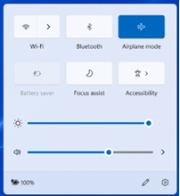
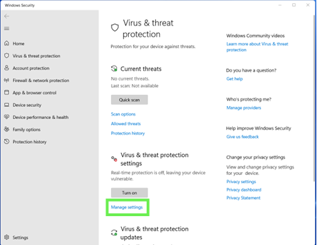

Ensure installation steps outlined in [Technical Manual](technical-manual.qmd) are completed prior to administration

## Simple Stop Task

**Administration time:** approximately 10 minutes (2 minutes per block).

What we are trying to estimate in this task is response inhibition performance. In this Stop task participants make a speeded response to a visual stimulus and withhold their response when it is paired with a audio stop signal (i.e., *beep*). We are trying to calculate is what is known as Stop Signal Reaction Time (SSRT) which reflects the latency of the stopping process. SSRT cannot be measured directly because there is no overt response that latency of which can be measured when you stop doing something.

The task will run for **4 experimental blocks and 1 practice block, with 24 trials per block**. The task will pause after each block and a message will appear. If the screen is black the participant can press X or O to continue on to the next block. If the screen is white you need to provide corrective feedback to them (see instructions below) and then press 8 on the keyboard to allow them to continue.

::: {#tip-shorcut .callout-tip}
## Make a PsychExp Shortcut

To launch the task from the Desktop, instead of having to navigate to the SchacharLabTaskFolder_v6.3.1 Folder each time you run a participant, create a PsychExp shortcut on the Desktop from the Task Folder (steps available in [Technical Manual](technical-manual.qmd))
:::

{#fig-pe}

## General Instructions

1.  Explain the instructions for each task, **verbatim**, to the child as described in this manual.

2.  Position yourself so that you can see the participant’s actions throughout the task and **do not leave the child unattended at any time!** Sit beside the child while they are completing the computer tasks to ensure that they are focused and following instructions.

3.  During the **practice block**, watch and see if the child is executing the task correctly. If the child is making errors during the practice, **point out the error promptly and instruct the child again**. A second practice is required if the child is having difficulty

4.  Once the child begins the test blocks, the most appropriate time to **recap the instructions is when the task pauses after each block**. Continue to recap the instructions after every block as needed.

5.  Children tire easily of these tasks because they are repetitive. Always try and **encourage them to complete the task**. They may take breaks in between the blocks to rest.

6.  When the child has completed the entire task, **examine the test scores** summary sheet once again to ensure that the child has completed the task correctly and that there were no computer errors.

## Setting Up the Task

**Materials:** 

-   **Laptop** with PsychExp setup (see [Technical Manual](technical-manual.qmd))
-   **Laptop Charger**
-   **Game Controller**
-   **Quiet Room** 

1.  Check the **date** and the **time** on the laptop to ensure they are accurate

2.  Apply the following settings to turn off the background processes that will interfere with the task:

    -   Turn on Airplane Mode

    -   Turn off Virus & Threat Protection functions

::: {layout-ncol="2"}

:::

This process must be completed **every time** the task is administered

3.  Plug in charger regardless of battery level and plug in the game controller

4.  Double click on [**PsychExp**]{.fig-hover data-fig="fig-pe"} icon

5.  Click Simple Stop and then **Run**

6.  Enter the **Participant ID** (at the bottom of the screen), then click **Go**

7.  Click **Run**

    -   If a dialogue box with the message *“One or more of the log or output files already exist. Continue anyway?”* appears, click **Yes**

    -   If a dialogue box with the message *“stopsignal has already been run with subject ID XXX. Do you wish to continue?”* appears, this indicates the data for the ID will be **overwritten**, ensure this is acceptable if clicking **yes** otherwise click **no** and enter a different ID

**Important Controls:**

|  |  |  |
|------------------------|------------------------|------------------------|
| **Button**  | **Actions**  | **When to Use**  |
| **X** | Correct response | When a participant sees an X (and doesn’t hear a beep) |
| **O** | Correct response | When a participant sees an O (and doesn’t hear a beep) |
| **8** | Continue the task | When a white screen appear after providing feedback to a participant. |
| **P** | Pauses the task | Use when a participant needs a break during a block or if they put down the controller, etc. |
| **R**  | Resumes the task | Use when you have manually paused the task and the participant is ready to continue  |
| **Esc** | Exits the task | Use when a participant refuses to finish the task after you have tried to encourage them. |

## Administer the Task to a Participant

1.  Give participant the game controller

2.  Provide the following instructions **verbally (verbatim)**:

    -   You will see either an X or an O appear in the middle of the screen

    -   When you see an X, I want you to press the **top left button** (point to the corresponding button on the controller)

    -   When you see an O, I want you press the **top right button** (point to the corresponding button on the controller)

    -   Sometimes you will hear a beep. When you hear the beep, don’t press anything

    -   Let’s check, when you see an X what do you press? \[participant points to X button\], when we you an O what do you press \[participant points to O button\], and when you hear a beep, what do you do \[don’t press anything\]

    -   **Go as fast as you can, try not to make mistakes**, and **don’t wait for the beep.**

    -   Do you have any questions?

3.  Click **Run Scenario**.

4.  Audio Instructions will then start to re-explain the task.

5.  When ready, press **Enter** to start the task.

### Practice Block:

-   The first block is a “pre-experimental block” in that none of the responses are saved. But it is imperative that the participant plays this round correctly to ensure valid scores for the next 4 experimental blocks.

-   If after the practice block a white screen appears press ‘esc’ to cancel the task and **re-start the task**.

-   Watch the participant closely and **provide feedback (see table below) between blocks when necessary.**

-   **Black Screen:** participant playing correctly, no feedback required

-   **White Screen:** participant playing incorrectly, provide feedback

-   When the task finishes, a **Thank You** screen appears. Press **X or O one more time** to close the screen. **DO NOT** press escape to end the task as you may lose data.

-   In the dialogue box, press **Continue**, then **Finish**. At this point you can close out of Presentation.

***Children may easily tire of the task and require close monitoring and encouragement when breaks in the task allow for it.***

### Provide Corrective Feedback to a Participant

White screens with text appear between blocks when the game determines the participant is playing incorrectly. The black and white screens between the blocks will also show you the participant’s scores for each round.

**PCR:** percent correct responses. This refers to how often they are correctly pressing X and O regardless of the stop signal and should be should be above **80%**

**PSI:** percent stop inhibition. This refers to how often they are inhibiting when they hear a beep and should be in between **12.5% to 87.5%**

**SSRT:** stop signal reaction time. This refers to the latency of the stopping process. 

**MCRT:** mean correct reaction time. This refers to how fast they are responding when they see an X or O and should be **below 500ms**

The messages that you will see are:

|  |  |  |  |
|------------------|------------------|------------------|------------------|
| **White Screen Trigger** | **Text on White Screen** | **What Participant is likely doing Wrong** | **Feedback to be provided to Participant** |
| There are 0 trials with responses | **No responses were detected**. | Participant **did not press** the X nor the O button or they may be pressing the **wrong buttons** on the controller. | Review buttons with participant and remind participant to press X or O buttons when prompted. |
| If the **percent of correct responses** on go trials \<= 50% | **You may be pressing the wrong button.** | Participant likely **mixing up** the X and O buttons or pressing the wrong buttons. | Review buttons with participant. |
| If the **MCRT time has changed** since the last block by +/-150ms | **Don’t forget to go as fast as you can without pressing the wrong button.** | Participant likely pressed button **after** the X/O disappeared from the screen. | Remind participant to go as fast as they can and to not press when they hear a beep. |
| The **percent stop inhibition** is \< 12.5 or \> 87.5 | **Don’t forget to go fast and stop when you hear a beep.** | Participant is **waiting too long** to press the X or O button (i.e.: waiting to see if beep will come). | Remind participant to go as fast as they can and to not wait for the beep. |

## Printable Stop Task Cheat Sheet


