# Simple Stop & N-Back Task Technical Guide

**Preamble**

The following manual will first guide users on how to install, activate the Stop and N-Back Tasks. Then will orient users to the task data outputs. Please see the [Stop Task Administration Guide](stop-admin.qmd) and [N-Back Task Administration Guide](nback-admin.qmd) for detailed instructions on administering each task.

After reading through the manual and installing the tasks on your research measures laptop, we suggest running yourself on the task 3-5 times. We are happy to look at the data outputs if you send us the files following the steps outlined in [Data Transfer](data-transfer.qmd). We extend this offer in an effort to ensure that the task properly operates and scores data.

Please send files to **Crosbie Lab Data (crosbielab.admin\@sickkids.ca).**

## Install Presentation

Presentation is a stimulus delivery and experiment control program to be used to run neuroscientific tasks created by NeuroBehavioural Systems (NBS).

To run the Stop and N-Back Tasks, you need to purchase and download Presentation on the research measures laptop you are using to administer the tasks. Presentation can be ordered online or purchased in hard format on a USB key; activations for Presentation can be ordered online. We use online purchasing. Each year you need to purchase a new license to keep the software active.

You may already have Presentation downloaded on your research measures laptop. If not, to purchase Presentation or online activations for Presentation, go to the Neurobehavioral Systems website ([www.neurobs.com](http://www.neurobs.com/)) and follow the purchase and downloading steps. Any questions you have about Presentation should be directed to Neurobehavioral Systems.

Important Note: New updates to *Presentation* may cause compatibility issues with the Stop Task code. **We recommend using Presentation Win 32 Version 25.0**

## Activate Presentation License

After purchasing and downloading the software:

1.  Open a Presentation window on the desktop. Click on **Activate**

2.  Highlight and copy (ctrl+C) the code in Line 3 - *Do not close this window*

3.  Go to [www.neurobs.com](http://www.neurobs.com/)

4.  Log in using your NeuroBS Username and Password

5.  A list of current licenses will appear. Click on **Activate** - Paste (ctrl+v) the code you copied from the Presentation screen then click activate.

6.  A new activation code will appear - *Do not close this window*

7.  Highlight and copy (ctrl+c) the code back into your presentation window in Line 4. Click **Submit**

This software comes with absolutely no warranty. Your feedback on these installation instructions is appreciated. Please send your comments or questions to **Crosbie Lab Email**

## Download the SchacharLabTaskFolder_v6.3.1 Folder

*These instructions assume that you can see the three-letter file extensions on your files.Please ensure that your file viewer allows you to see the extensions.*

**If you are updating an old task folder start here:**

1.  Find your old Schachar Lab Task Folder that is currently saved on your research measures laptop
2.  Find the SimpleStop and NBack folders inside the task folder where the task output data files are saved
3.  Save and back-up all the task output data files from these folders as per your data storage requirements
4.  Delete the old task folder and all of its contents

**For new task folder start here:**

1.  Download the zipped version of the SchacharLabTaskFolder_v6.3.1 that was emailed to you on the research measures laptop’s desktop
2.  Right click on the folder and select **Extract All**
3.  Remove the zipped SchacharLabTaskFolder_v6.3.1
4.  You can place the unzipped SchacharLabTaskFolder_v6.3.1 Folder anywhere on the laptop that is convenient
    -   If using a device that syncs with OneDrive or SharePoint ensure that the SchacharLabTaskFolder is excluded from syncing as those processes can remove local files to free up space without warning
    -   Do not add or remove files from inside the SchacharLabTaskFolder except for data transfers
5.  Create a shortcut of PsychExp to run the tasks from your desktop without needing to open the folder each time:
    -   Right-click the PsychExp Icon -\> Show More Options -\> Create a Shortcut
    -   This shortcut can be moved to any location (such as the Desktop) and will run the task regardless of where the folder is located

::: {layout-ncol="2"}
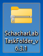

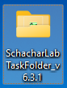
:::

## Check Task Settings

Two files within the SchacharLabTaskFolder_v6.3.1 need to be verified by you to ensure the task will run correctly:

-   stopsignal.exp

-   nback.exp

The .exp files contain configuration settings that are specific to the computer you are using. It keeps track of settings you change in Presentation, such as: where to find image files, what response device you are using, where to write output files, etc.

**Please review the pictures below to ensure that your research measures laptop settings are the same**. Modify the settings when necessary. The settings should be pre-programmed so there should only be very minor changes required.

### Stop Task: Verifying the .exp File

1.  Double click **stopsignal.exp**
2.  Presentation should open if the .exp file extension has been associated with the Presentation software. If it does not open then Presentation may be set up incorrectly.
3.  On the Presentation **Main** tab, ensure the Logfile Directory is set to the SchacharLabTaskFolder_v6.3.1 Folder (for convenience you can copy that entire directory path as you will be using it a few more times).
4.  On the **Scenarios** tab, again ensure the Logfile Directory is set to the SchacharLabTaskFolder_v6.3.1 Folder.
5.  On the **Scenarios** tab, the Stimulus Directory should also be set to the SchacharLabTaskFolder_v6.3.1 Folder (the Scenarios box should have the stopsignal.sce file from the task file directory – this file is created each time you run the experiment with the parameters you choose).
6.  On the **Parameters** tab, the default configuration is selected and the parameters data grid should be empty.
7.  On the **Settings** tab please ensure the following tabs match the images below:
    -   [General @sec-genst]
    -   [Response @sec-resst]
    -   [Video @sec-vidst]
    -   [Audio @sec-audst]
    -   [Port @sec-prtst]
    -   [Logfiles @sec-logst]
    -   [FTP @sec-ftpst]
    -   [Advanced @sec-advst]

<!-- -->

8.  Now **save your settings**. Under the Experiment drop down menu, select “Save Experiment.” This updates the stopsignal.exp file in the main task directory.
9.  Exit the program entirely.

**The next time you start the task, all your settings should be retrieved – you should check to see that this is true.**

#### General {#sec-genst}

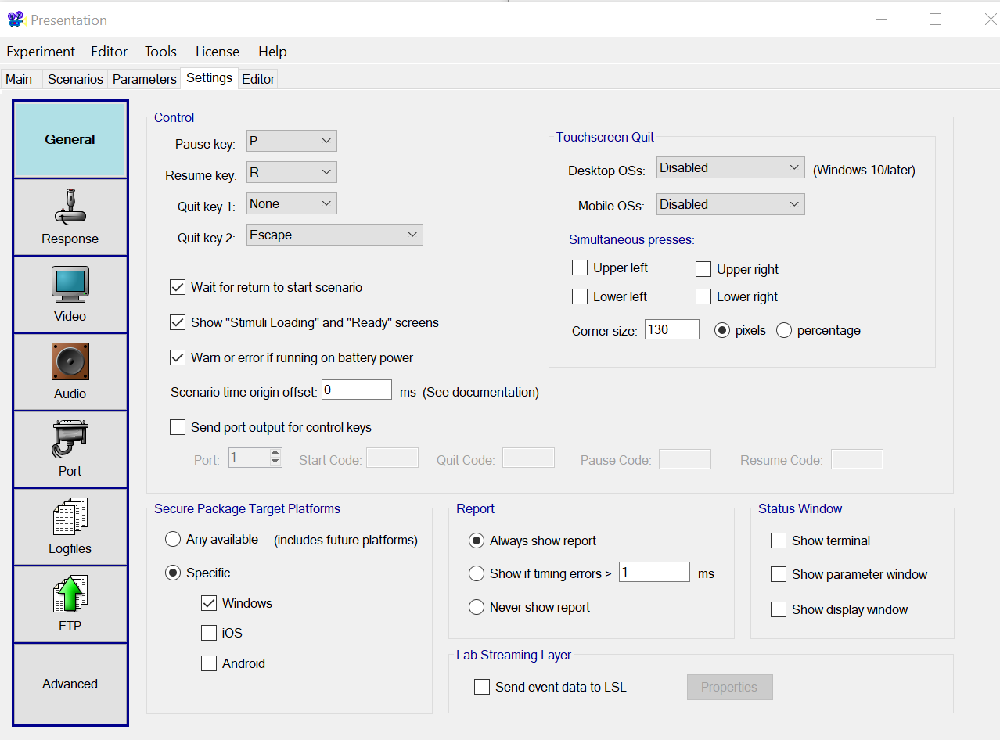{fig-align="center"}

#### Response {#sec-resst}

**Stop Task Game Controller Configurations** 

We use the **Logitech Precision Gamepad 2** but other Stop Task users have reported the **Precision Gamepad 2** is becoming increasingly difficult to find. Essentially, you want a basic, brand name, wired controller. A suitable alternative is the **Logitech Gamepad F310.**

::: {layout-ncol="2"}

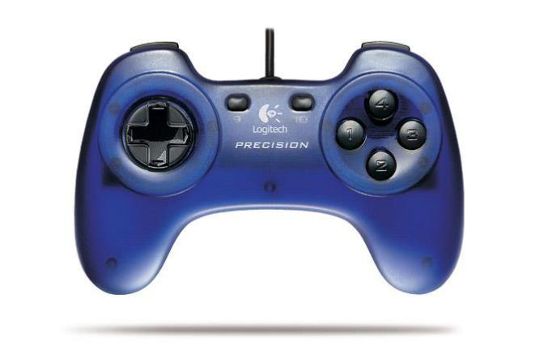{width="250"}

:::

**Program Response Buttons on the Game Controller**

1.  The default scenario settings should be clear
2.  In the **Scenarios** box select **StopSignal.sce**

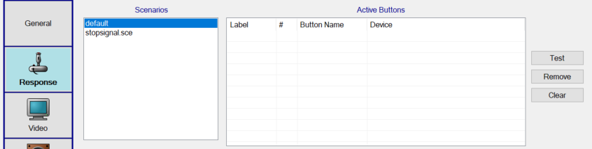{fig-align="center"}

3.  Ensure that the **Active Axis/Force Devices** box is empty
4.  In the **Devices box** below, click on the device you wish to program (e.g., Logitech®Precision™ Gamepad) so it is highlighted
5.  A list of available buttons for that device will appear on the right. If not already there you need to double-click on each button in order to move them into the **Active Buttons box**
    -   Ensure that no labels are assigned in the Active Buttons box as this may add extra data to the output file that will confusing the scoring program
6.  Click and drag the Active Buttons to rearrange to the correct order. The Active Buttons list should match the image below
    -   **Target button for X** = **Scenario Button #1** in the Active Buttons list

    -   **Target button for O** = **Scenario Button #2** in the Active Buttons list

    -   **Keyboard 8** **= Scenario Button #3** in the Active Buttons list

    -   **Mouse Button 1** = Scenario Button #4 in the Active Buttons list

    -   **Mouse Button 2** = Scenario Button #4 in the Active Buttons list

        **\*\*NOTE:** for some laptops with Windows 11 Mouse Button 2 is unavailable, instead set Mouse Button = 0 and Mouse Button = 1

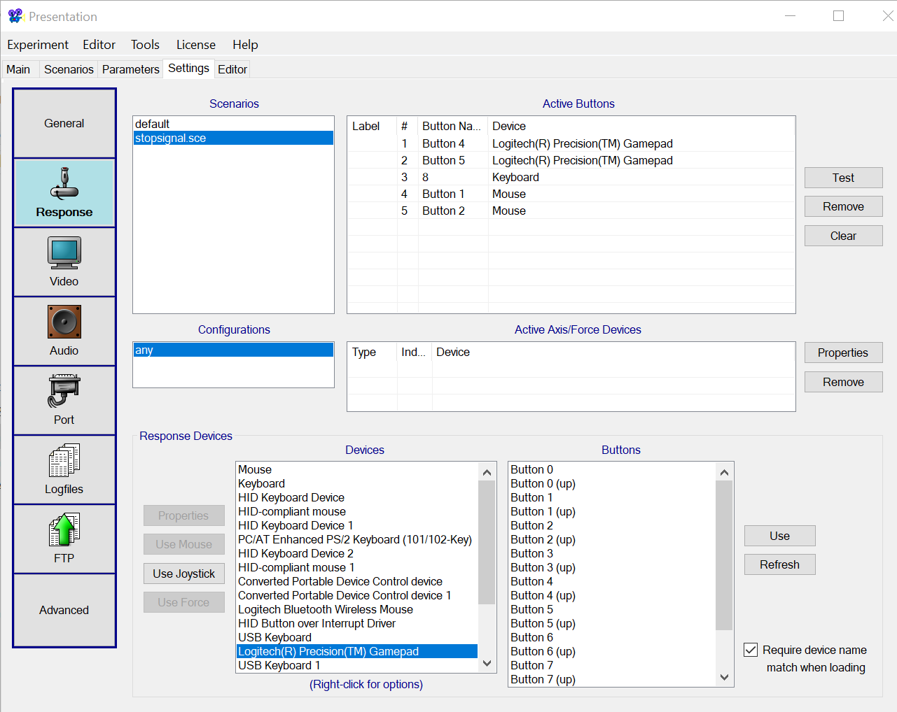{fig-align="center"}

5.  To test the controller, click **Test** and the Input Button Test box will open. Press the buttons you have programmed as X and O. X should appear as Scenario Button #1 (written in red letters on the screen) and O should appear as Scenario Button #2 (again written in red letters on the screen)
6.  Label these buttons on the physical controller using stickers identifying X and O

#### Video {#sec-vidst}

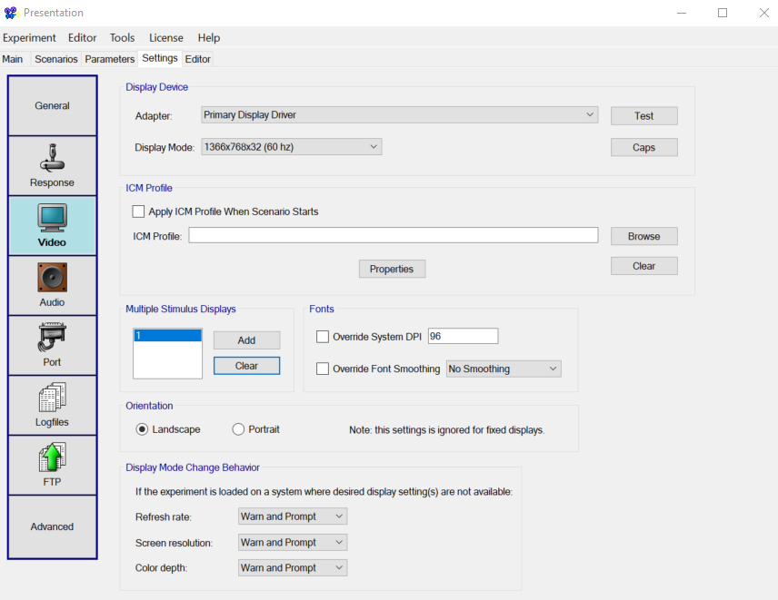{fig-align="center"}

Guidance for selecting appropriate settings if needed:

-   Choose a 60Hz display mode that works for your computer

-   If the task looks too big, too small, or if Presentation complains when loading that the selected display mode or screen resolution is not available for your computer, change it to another available display mode and click the “Test” button to check it.

-   At very low resolution the test word “Hello” will appear large and pixelated, and at very high resolution the test word “Hello” will be sharp but tiny.

-   The image above is from Presentation version 21 which includes the “Orientation” settings. This may not be in the current version of Presentation, but we use fixed displays so the setting isn’t relevant.

#### Audio {#sec-audst}

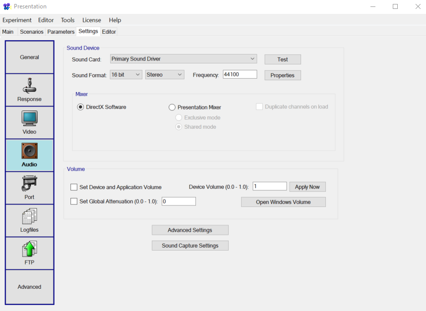{fig-align="center"}

#### Port {#sec-prtst}

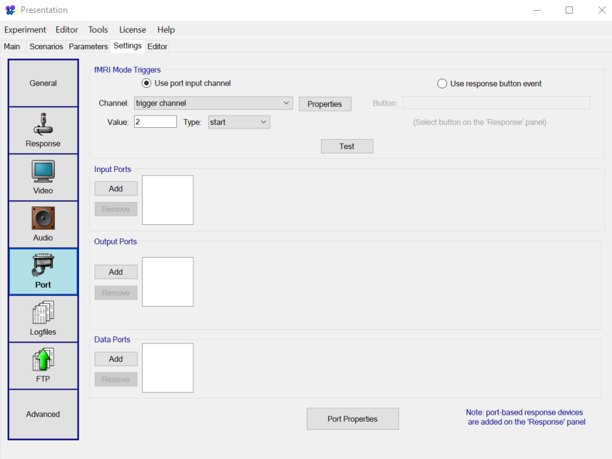{fig-align="center"}

#### FTP {#sec-ftpst}

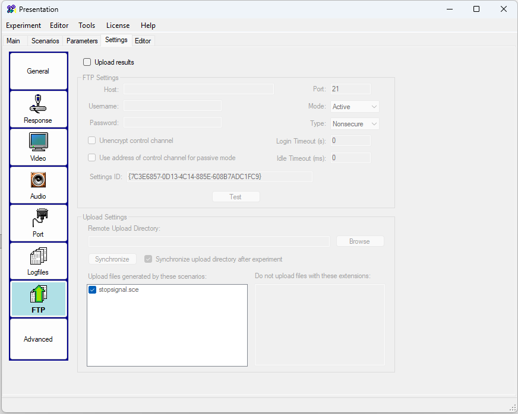{fig-align="center"}

#### Logfiles {#sec-logst}

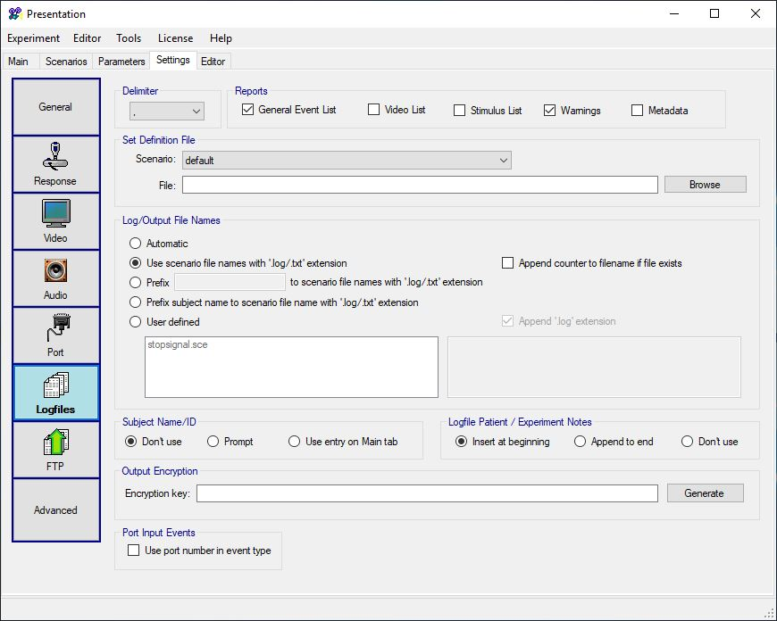{fig-align="center"}

#### Advanced {#sec-advst}

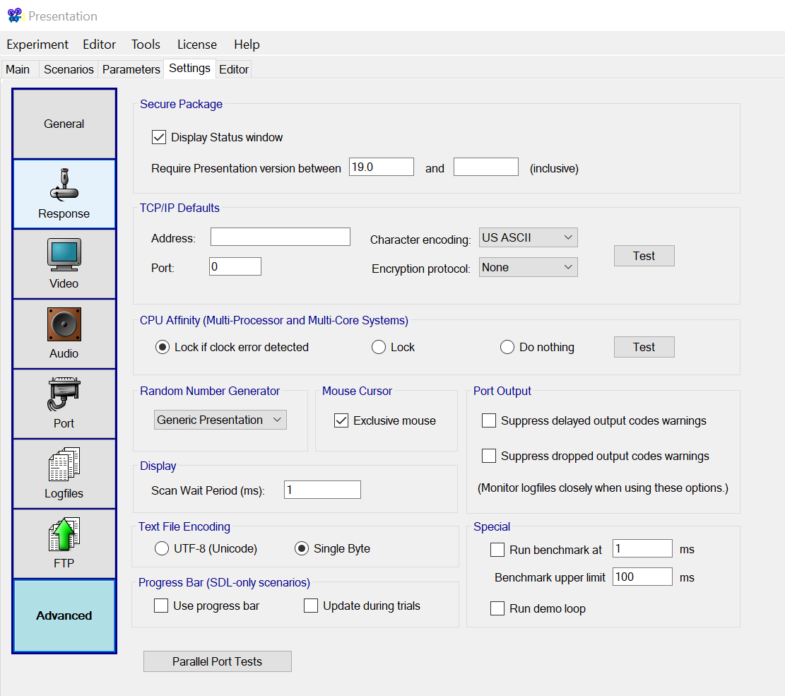{fig-align="center"}

### N-Back Task: Verifying the .exp File

1.  Double click nback.exp

2.  Presentation should open if the “.exp” file extension has been associated with the Presentation software. If it does not open then Presentation may be set up incorrectly.

3.  On the Presentation **Main** tab, ensure the Logfile Directory is set to the SchacharLabTaskFolder_v6.3.1 Folder (for convenience you can copy that entire directory path as you will be using it a few more times).

4.  On the **Scenarios** tab, again ensure the Logfile Directory is set to the SchacharLabTaskFolder_v6.3.1 Folder.

5.  On the **Scenarios** tab, the Stimulus Directory should also be set to the SchacharLabTaskFolder_v6.3.1 Folder (the Scenarios box should have the nback.sce file from the task file directory – this file is created each time you run the experiment with the parameters you choose).

6.  On the **Parameters** tab, the default configuration is selected and the parameters data grid should be empty.

7.  On the **Settings** tab please ensure the following:

-   [General @sec-gennb]
-   [Response @sec-resnb]
-   [Video @sec-vidnb]
-   [Audio @sec-audnb]
-   [Port @sec-prtnb]
-   [Logfiles @sec-lognb]
-   [FTP @sec-ftpnb]
-   [Advanced @sec-advnb]

8.  Now **save your settings**. Under the Experiment drop down menu, select “Save Experiment.” This updates the stopsignal.exp file in the main task directory.

9.  Exit the program entirely.

**The next time you start the task, all your settings should be retrieved – you should check to see that this is true.** 

#### General {#sec-gennb}

{fig-align="center"}

#### Response {#sec-resnb}

1.  The default scenario settings should be clear
2.  In the **Scenarios** box select **nback.sce**
3.  Ensure that the **Active Axis/Force Devices** box is empty
4.  In the **Devices box** below, click on the device you wish to program (e.g., Keyboard) so it is highlighted
5.  A list of available buttons for that device will appear on the right. If not already there you need to double-click on each button in order to move them into the **Active Buttons box**
    -   Ensure that no labels are assigned in the Active Buttons box as this may add extra data to the output file that will confusing the scoring program
6.  Click and drag the Active Buttons to rearrange to the correct order. The Active Buttons list should match the image below

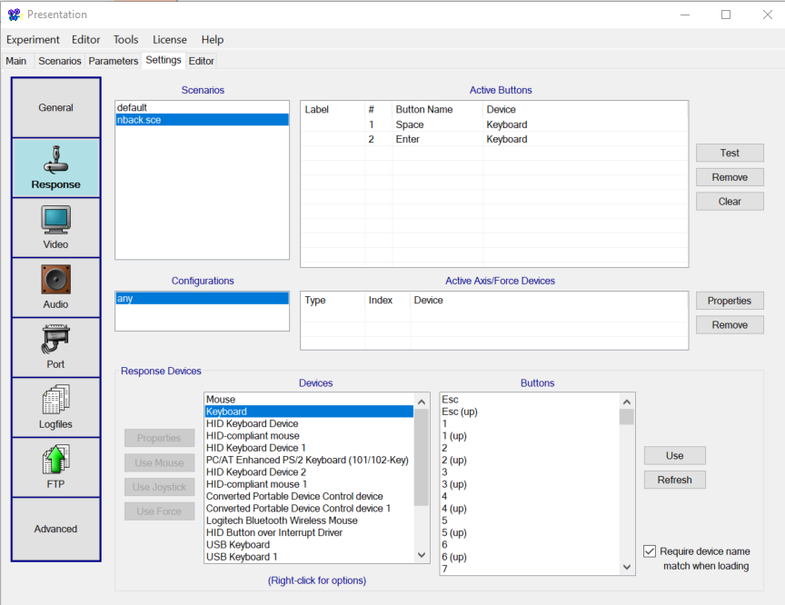{fig-align="center"}

7.  To test the keyboard, click **Test** and the Input Button Test box will open. Press the Space and Enter keys and they should appear as Scenario Button #1 Scenario Button #2

#### Video {#sec-vidnb}

{fig-align="center"}

Guidance for selecting appropriate settings if needed:

-   Choose a 60Hz display mode that works for your computer

-   If the task looks too big, too small, or if Presentation complains when loading that the selected display mode or screen resolution is not available for your computer, change it to another available display mode and click the “Test” button to check it.

-   At very low resolution the test word “Hello” will appear large and pixelated, and at very high resolution the test word “Hello” will be sharp but tiny.

-   The image above is from Presentation version 21 which includes the “Orientation” settings. This may not be in the current version of Presentation, but we use fixed displays so the setting isn’t relevant.

#### Audio {#sec-audnb}

{fig-align="center"}

#### Port {#sec-prtnb}

{fig-align="center"}

#### FTP {#sec-ftpnb}

{fig-align="center"}

#### Logfiles {#sec-lognb}

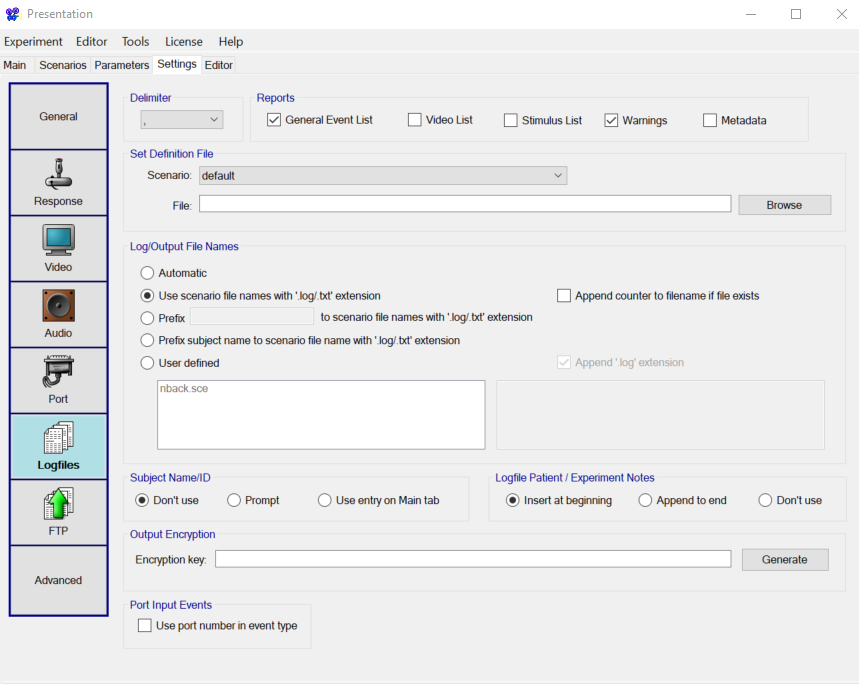{fig-align="center"}

#### Advanced {#sec-advnb}

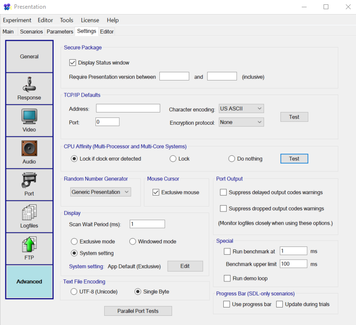{fig-align="center"}
